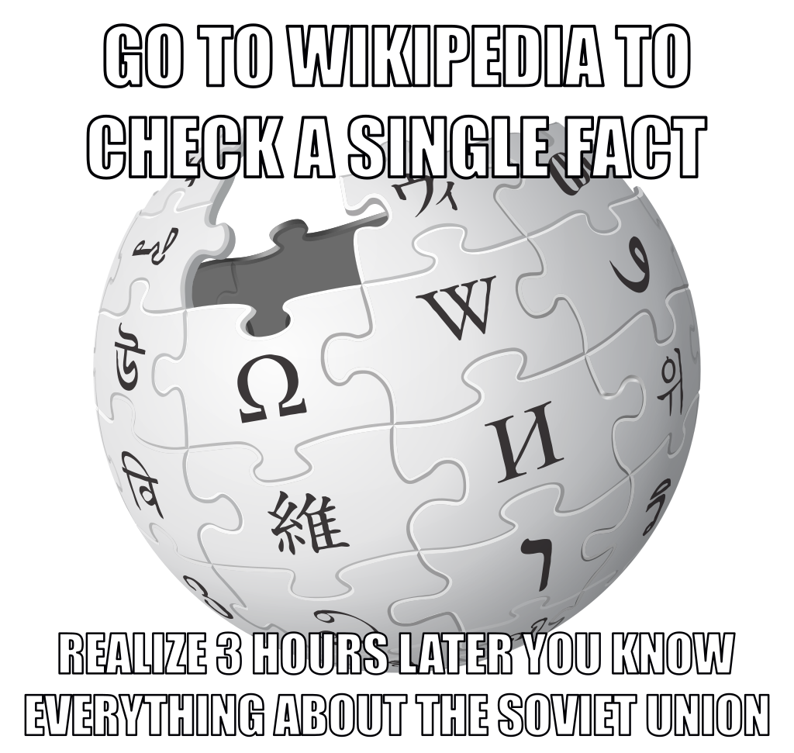
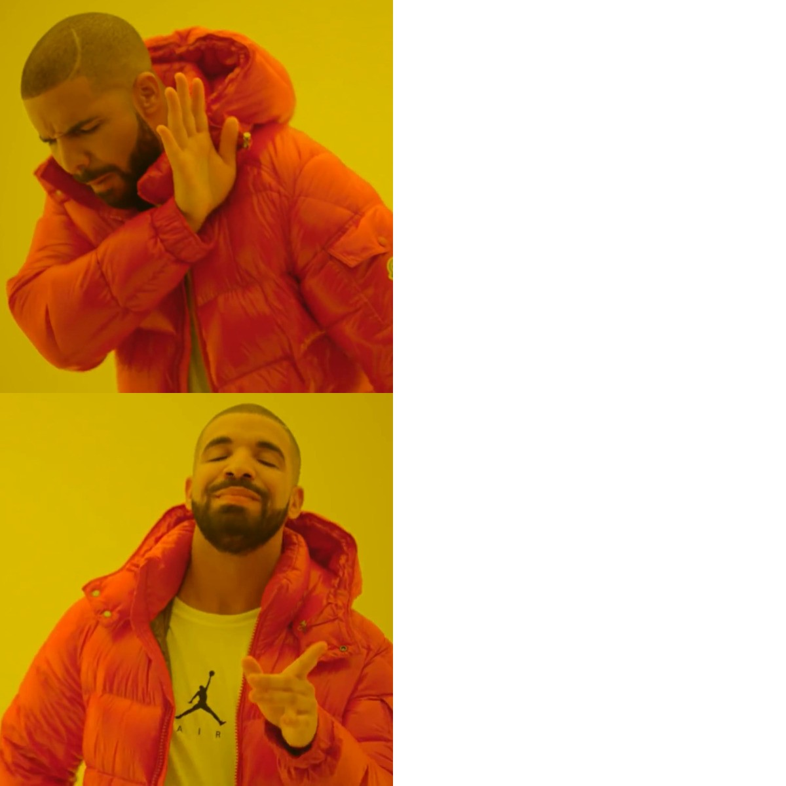
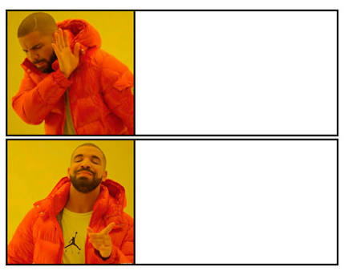
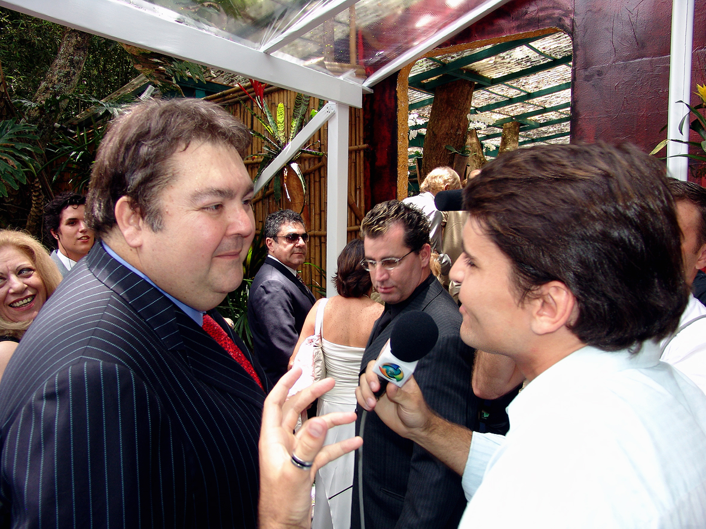

# Abertura {#abertura}

## Vocês são o trainee

Hoje o laboratório emula o **primeiro emprego**: estágio, trainee, júnior.

Isto **não** é um tom a suavizar. A Diretoria de Pesquisa Aplicada é a demanda realista: e-mail da chefia, recorte travado, reunião no fim do expediente.

Três papéis, três arquivos:

1. Vocês = o trainee.
2. O briefing = o e-mail da Diretoria.
3. O prompt do colega = o atalho das 17h42.

::: notes
Núcleo · bloco de 5 min. Ainda não abrir o CSV nem o contrato inteiro. Deixar a cena (17h42 / 18h) no ar. As três dimensões numa frase: demanda e slop; rotina Python que grava o CSV; um `.qmd` que vira PPTX e Reveal.js. Se alguém perguntar "é pra valer o tom da Diretoria?": sim — no briefing e no produto; neste deck falamos com o estudante.
:::

## Wikipedia não é fonte → prompt não é fonte

{fig-alt="Meme clássico de image macro sobre Wikipedia" .meme}

O cartaz do minicurso é este deslocamento: a escola já ensinou que enciclopédia não basta; o laboratório ensina que **o chat também não**.

<p class="meme-nota">Uso acadêmico, sem fins comerciais · minicurso PUC · Semana da Economia</p>

::: notes
Núcleo. O SVG é o meme clássico da Wikipedia (ir conferir um fato, sair três horas depois). Ligar ao cartaz, não dissertar sobre Wikipedia.
:::

## 17h42. Reunião às 18h.

<div class="fallback-meme">
<p>se vira nos 30</p>
<p>o prazo do trainee</p>
<p>não é o método</p>
</div>

O cronômetro existe. O método **não** é "manda um HTML único".

<p class="meme-nota">Uso acadêmico, sem fins comerciais · minicurso PUC · Semana da Economia</p>

::: notes
Núcleo. Referência: Silvio Santos ("se vira nos 30") — testar se a turma pega; se não, só o cronômetro basta. O retrato de acervo (Wikimedia) não foi baixado por limite da CDN (HTTP 429); o recorte fica em texto. Não improvisar foto. Frisar: prazo ≠ autorização para inventar número.
:::

# Antes de começar {#antes}

## Ao sair daqui, vocês vão saber

1. **Distinguir** um HTML apresentável de uma rotina que se reroda.
2. **Aplicar** quatro perguntas — pergunta, indicador, fonte/vintage, reroda? — a qualquer número que chegue por chat.
3. **Ler** um CSV-contrato: `iso3`, código do indicador, vintage — e achar uma célula sem perguntar ao modelo.

Nada disso exige programar hoje. Exige saber **o que é cada arquivo** e **quem lê o quê**.

::: notes
Núcleo · bloco de 7 min começa aqui (1 min neste slide). Três verbos, sem enfeite. Voltar a eles no quiz do fecho.
:::

## Extensões (1/2): o que cada arquivo é

::: {.tabela-compacta}
| Extensão | O que é | No clone |
| --- | --- | --- |
| `.md` | Texto legível. Referência para **pessoas** e para **ferramentas de IA** | `README.md`, `CONTRATO.md`, `AGENTS.md`, `briefing-supervisao.md` |
| `.py` | Script Python: executa, baixa, valida | `baixar_fm.py`, `validar_contrato.py`, `preparar_lab.py` |
| `.csv` | Tabela em texto puro. Aqui, a **única** fonte de número | `fm_weo_cache.csv` |
| `.qmd` | Quarto: texto + código → HTML e PPTX | `mini-fiscal-monitor.qmd` |
| `.html` | Página para o navegador. **Saída**, não fonte | o slop; o Reveal.js do produto |
| `.pptx` | PowerPoint gerado pelo Quarto | `outputs/pptx/` |
| `.toml` `.yml` `.lock` | Configuração e dependências travadas | `pyproject.toml`, `_quarto.yml`, `uv.lock` |
| `.json` | Dado bruto como veio da API | `data/raw/` |
| `.scss` `.css` | Aparência | tema slate / indigo / sky |
:::

::: notes
Núcleo · 2 min. Não ler linha a linha: apontar três — `.md` (pessoa e IA leem), `.csv` (o número mora aqui), `.html` (saída). O resto fica para `docs/ferramentas.md`.
:::

## Extensões (2/2): quem lê o quê

::: {.tabela-compacta}
| Arquivo | Humano | Python | Quarto | Navegador | Ferramenta de IA |
| --- | --- | --- | --- | --- | --- |
| `.md` | lê | — | lê como texto | — | **lê como referência** |
| `.csv` | lê | **lê** | via Python | — | só se você anexar |
| `.py` | lê | **executa** | executa no chunk | — | lê e escreve |
| `.qmd` | lê | — | **renderiza** | — | lê e escreve |
| `.html` | — | — | gera | **exibe** | — |
:::

O chat **não** aparece nesta tabela como fonte. O `.md` diz ao modelo o que ele **pode** fazer; o `.csv` diz **qual** número existe.

::: notes
Núcleo · 1 min. É o slide que amarra o cartaz à prática: `AGENTS.md` e `CONTRATO.md` são lidos pelo agente de IA como regra; nenhum deles contém número. Quem quiser número abre o `.csv`.
:::

## Ferramentas na mesa

::: {.tabela-compacta}
| Ferramenta | O que é | Quem usa hoje |
| --- | --- | --- |
| Navegador + GitHub | ver arquivos, o CSV e o produto publicado | todos <span class="degrau">degrau 1</span> |
| VS Code | abrir o clone; ler `.md`, `.csv`, `.py` | todos <span class="degrau">degrau 2</span> |
| git | clonar o repositório | quem tiver |
| Python 3.13 + `uv` | rodar scripts com dependências isoladas no `.venv` | quem tiver <span class="degrau">degrau 3</span> |
| Quarto | `.qmd` → Reveal.js e PPTX | professor, na demo |
| Netlify | hospeda **só** o Reveal.js do produto | professor |
| DataMapper (FMI) | API de origem do dado; só `baixar_fm.py` fala com ela | ninguém hoje: usamos o cache |
| R / RStudio | ecossistema irmão | hoje não |
:::

<p class="cue"><strong>Abrir agora:</strong> <code>docs/ferramentas.md</code> <span class="path-hint">(material de apoio; fica no clone)</span></p>

::: notes
Núcleo · 1 min. Ninguém cria conta em nada. Aluno não precisa de Quarto nem de Netlify. RStudio existe no laboratório, mas o contrato mantém R só como menção.
:::

## Cheque a máquina: três degraus

- <span class="degrau">degrau 1</span> Navegador: GitHub aberto + URL do produto.
- <span class="degrau">degrau 2</span> VS Code com o clone aberto. **Basta para toda a aula.**
- <span class="degrau">degrau 3</span> Terminal do VS Code, na raiz do clone:

```bash
python scripts/preparar_lab.py
```

Esperado no fim: `STATUS: CSV OK` e `DEGRAU: 3`. Se parar em `DEGRAU: 2`, a aula segue igual.

No VS Code: **Terminal → Run Build Task** roda o mesmo comando.

::: notes
Núcleo · 2 min. Não esperar a turma inteira: o `sync` roda em segundo plano enquanto lemos o briefing. O script instala só o executável `uv` para o usuário se faltar; dependências ficam no `.venv` do clone. Sem admin, sem token. Quem estiver no degrau 1 acompanha pelo GitHub.
:::

# A demanda {#demanda}

## Isto é o e-mail da Diretoria

Pedido curto, recorte travado, vintage explícita, dois indicadores, cinco países.

Não é paper. Não é dashboard cosmética. É:

**pergunta → indicador → fonte/vintage → gráfico que se reroda.**

<p class="cue"><strong>Abrir agora:</strong> <code>01-demanda-simulada/briefing-supervisao.md</code></p>

::: notes
Núcleo · bloco de 18 min começa aqui. Ler em voz alta o briefing (recorte + o que não fazer + prazo). Não ler o CONTRATO.md inteiro. México = LatAm já aparece no e-mail; China fora já aparece no e-mail.
:::

## Isto é o prompt do colega

Colado no chat às **17h42**, reunião às **18h**.

> dashboard html bem bonito · américa do sul + índia indonésia · números recentes · pode inventar · o importante é ficar apresentável · título em inglês · html único sem python

<p class="cue"><strong>Abrir agora:</strong> <code>01-demanda-simulada/prompt-do-junior.md</code></p>

::: notes
Núcleo. Projetar o arquivo, não o resumo. Deixar a turma ouvir "pode inventar" e "América do Sul". Colômbia no prompt; Chile no briefing.
:::

## Pode inventar. O importante é ficar apresentável.

{fig-alt="Meme Ancient Aliens: afirmação sem evidência" .meme}

**source: trust me bro** — e a variante nacional, *me engana que eu gosto*.

O junior autorizou o modelo a fabricar valor. A Diretoria tinha **proibido**.

<p class="meme-nota">Uso acadêmico, sem fins comerciais · minicurso PUC · Semana da Economia</p>

::: notes
Núcleo. Não moralizar o colega: mostrar o incentivo (reunião em 18 min). A falha é epistemológica, não estética.
:::

## O HTML jura. 60 segundos em silêncio.

Não comentar ainda. Deixar o visual trabalhar.

Números **deste** HTML (slop, de propósito): Brasil dívida **78,2%**, "superávit" **+3,1%**, "trajetória sustentável", México como América do Sul, Colômbia no ranking, *Emerging Markets Fiscal Health Dashboard*.

<p class="cue"><strong>Abrir agora:</strong> <code>01-demanda-simulada/entrega-slop/index.html</code></p>

::: notes
Núcleo. Cronometrar 60 s. Esses números são do HTML slop — podem aparecer. Não contrastar ainda com o CSV (isso seria ditar o número certo). Autópsia DEPOIS da atividade.
:::

## Atividade 1 · Três violações {.slide-atividade}

::: {.atividade}
[3 min · em duplas · sem teclado]{.atividade-meta}

O briefing está no projetor. O HTML está na tela. Apontem **três** pontos em que o HTML viola o que a Diretoria pediu.

Vale geografia, recorte, fonte, vocabulário. **Não** vale "o número está errado" — ainda não abrimos o CSV.
:::

::: notes
Núcleo · 3 min cronometrados. Pedir três duplas para dizer uma violação cada. Anotar na lousa sem corrigir. A autópsia vem depois e confirma (ou não). Se alguém disser "o superávit está errado": "como você sabe? qual arquivo você abriu?" — é a ponte para a Atividade 2.
:::

## É mentira, Téo?

<div class="fallback-meme">
<p>é mentira, Téo?</p>
<p>o HTML jura superávit</p>
<p>o CSV é quem manda</p>
</div>

O erro não é o fundo escuro. É o número que **não reroda**.

<p class="meme-nota">Uso acadêmico, sem fins comerciais · minicurso PUC · Semana da Economia</p>

::: notes
Núcleo. Transição para as 4 perguntas. Recorte em texto (still do programa de TV não baixado). Não abrir a autópsia antes do HTML. Não ditar o primário certo do Brasil.
:::

## Autópsia: quatro perguntas, não dez acusações

Na lousa, nesta ordem (`docs/checklist-rigor.md`):

1. Qual é a pergunta?
2. Qual é o indicador? (código, setor, unidade)
3. Qual é a fonte / vintage?
4. Dá para rerodar?

<p class="cue"><strong>Abrir agora:</strong> <code>01-demanda-simulada/instrutor/autopsia.md</code> <span class="path-hint">(depois do slop; está no clone)</span></p>

::: notes
Núcleo. Autópsia depois do HTML e da Atividade 1: cruzar com o que a turma apontou. Conferir na mão contra o CSV depois, sem copiar número para este deck. Falhas de palco: geografia, recorte (Colômbia vs Chile), vintage ausente, "sustentável" sem critério, título em inglês.
:::

# O contrato {#contrato}

## Cinco países, dois códigos, uma vintage

Não vamos ler o arquivo inteiro.

| Ordem | iso3 | Papel no recorte |
| --- | --- | --- |
| 1 | `BRA` | Núcleo LatAm |
| 2 | `MEX` | Núcleo LatAm — **não** é América do Sul |
| 3 | `CHL` | Núcleo LatAm (entrou; Colômbia saiu) |
| 4 | `IND` | Emergente de destaque |
| 5 | `IDN` | Emergente de destaque |

Indicadores: `GGXWDG_NGDP`, `GGXONLB_NGDP`. Vintage: FM/WEO **abril/2026**.

<p class="cue"><strong>Abrir agora:</strong> <code>CONTRATO.md</code> <span class="path-hint">(só o recorte, se precisar)</span></p>

::: notes
Núcleo · bloco de 6 min. Não projetar o CONTRATO página a página. China fora: próximo slide. Sem número fiscal.
:::

## México não é América do Sul

{fig-alt="Meme Drake Hotline Bling: recusar vs aceitar" .meme}

Cima: "México, América do Sul, uns emergentes".  
Baixo: **LatAm**. Erro profissional, não aula de geografia.

<p class="meme-nota">Uso acadêmico, sem fins comerciais · minicurso PUC · Semana da Economia</p>

::: notes
Núcleo. O slop escreveu México (América do Sul). No material do minicurso o núcleo é LatAm.
:::

## China "só para comparar": hoje não

{fig-alt="Meme No / Yes" .meme}

`CHN` distorce escala e narrativa. Fora de dado, gráfico, tabela e texto de produto.

Gretchen / "hoje não, Faro" — o recorte não negocia no feeling.

<p class="meme-nota">Uso acadêmico, sem fins comerciais · minicurso PUC · Semana da Economia</p>

::: notes
Núcleo. Template No/Yes no lugar do still da Gretchen (retrato de carnaval da Wikimedia devolveu 429). Manter leve; zero partidarismo.
:::

## Tradução para quem chegou agora

Três distinções, sem conta:

- **Governo geral ≠ governo central.** O recorte é GG (salvo nota de país no FM).
- **Primário ≠ nominal.** Primário = resultado **antes** de juros. Sinal FMI: positivo = superávit primário.
- **Vintage = edição**, não "dados recentes". Aqui: abril/2026, título *Fiscal Policy under Pressure: High Debt, Rising Risks*.

::: notes
Núcleo (calouros e ciências sociais aplicadas). Formandos aguentam o slide de gordura r−g mais tarde. Não calcular nada.
:::

# A rotina {#rotina}

## Python baixa; o `.qmd` não chama API

A Dimensão 2 é o único lugar que fala com o DataMapper. Na aula, o caminho seguro é o cache.

```bash
python 02-dados-fiscal-monitor/scripts/baixar_fm.py --offline
python scripts/validar_contrato.py
```

<p class="cue"><strong>Abrir agora:</strong> <code>02-dados-fiscal-monitor/scripts/baixar_fm.py</code></p>

::: notes
Núcleo · bloco de 13 min. Rodar `--offline` no projetor. Dicionário: códigos, sem série. Se a rede do laboratório deixar, mencionar o 403 do DataMapper como motivo do cache.
:::

## O validador passou. Agora sim.

{fig-alt="Meme epic handshake" .meme}

Contrato (esquerda) encontra CSV (direita). Esqueleto **e** schema.

Países na ordem `BRA`, `MEX`, `CHL`, `IND`, `IDN`. Sem `CHN`. Colunas na ordem do contrato.

<p class="meme-nota">Uso acadêmico, sem fins comerciais · minicurso PUC · Semana da Economia</p>

::: notes
Núcleo. Projetar a saída do validador (STATUS: esqueleto OK / CSV OK). Não transcrever valor.
:::

## Atividade 2 · Achem a linha {.slide-atividade}

::: {.atividade}
[5 min · individual · [degrau 2]{.degrau} basta · [degrau 3]{.degrau} opcional]{.atividade-meta}

Abram `02-dados-fiscal-monitor/data/processed/fm_weo_cache.csv` no VS Code (ou no GitHub). Localizem a linha `BRA` · `2025` · `GGXONLB_NGDP`.

Leiam o **sinal** de `value`. Comparem com o card "+3,1%" do slop. **Não** digam o número em voz alta: levantem a mão — positivo ou negativo?

Degrau 3: rodem `python scripts/preparar_lab.py --so-validar` e leiam `STATUS: CSV OK`.
:::

::: notes
Núcleo · 5 min. É o "aha" da aula e tem de ser do aluno: Ctrl+F por `BRA,2025` ou `GGXONLB` funciona no VS Code e no GitHub. Contar as mãos; não ditar o valor nem copiá-lo para o deck. Quem está no degrau 1 usa o CSV na visualização do GitHub (o arquivo abre como tabela).
:::

## Abrir o CSV. Não copiar número para o slide.

Colunas, nesta ordem:

`iso3`, `country`, `year`, `indicator_code`, `indicator_name`, `value`, `unit`, `vintage`, `source`

O deck de aula **não lê** este arquivo. O produto da Dimensão 3 **só** lê este arquivo. O slop **não** lê.

<p class="cue"><strong>Abrir agora:</strong> <code>02-dados-fiscal-monitor/data/processed/fm_weo_cache.csv</code></p>

::: notes
Núcleo. Mostrar cabeçalho e a linha que a turma acabou de achar, apontando `iso3` + `year` + código + `vintage`. Se alguém pedir o número do Brasil, abrir a célula — não ditá-la de memória, não copiar para o próximo slide.
:::

# O produto {#produto}

## Um `.qmd`, dois artefatos

O PPTX é o briefing interno da reunião (fala *como* a Diretoria). O Reveal.js é o **produto** publicado. Vocês deveriam ter entregue isto — não o dashboard das 17h42.

| Formato | Pasta | Destino |
| --- | --- | --- |
| Reveal.js | `outputs/revealjs-netlify/` | Produto no Netlify |
| PPTX | `outputs/pptx/` | Briefing interno; **não** se hospeda |

Os dois saem de `03-relatorio-qmd/mini-fiscal-monitor.qmd`. Números só via código que lê o CSV.

<p class="cue"><strong>Abrir agora:</strong> <code>03-relatorio-qmd/mini-fiscal-monitor.qmd</code></p>

::: notes
Núcleo · bloco de 13 min. Não executar chunk neste deck. Mostrar o YAML (theme, reference-doc, footer com vintage) e um chunk que lê o CSV: o número do slide nasce ali.
:::

## No projetor: o produto, não o slop

URL do produto (site ligado ao git): ****

Se a rede falhar, o caminho local `outputs/revealjs-netlify/` vale.

<p class="cue"><strong>Abrir agora:</strong> <code>outputs/revealjs-netlify/</code></p>

Aluno não cria conta. Publicado = somente este Reveal.js. O PPTX, o slop e este deck **não** vão ao Netlify.

::: notes
Núcleo. Um gráfico + tabela do ano-foco. Conferir 5 países, sem China, vintage no rodapé. Pedir à turma: "a linha que vocês acharam na Atividade 2 está neste gráfico?" — o ponto do Brasil no ano-foco, abaixo ou acima do zero. Se o URL já estiver colado, abrir o site; senão o HTML local.
:::

# IA com contrato {#ia}

## Dois prompts profissionais vs o junior

O junior autorizou inventar. Estes travam recorte, fonte e artefato.

<p class="cue"><strong>Abrir agora:</strong> <code>03-relatorio-qmd/roteiro-ia-profissional.md</code></p>

- Prompt 1 — rotina Python (Dimensão 2): schema, `--offline`, sem `CHN`.
- Prompt 2 — um `.qmd`, duas saídas, CSV como única fonte.

Prompt profissional **não** substitui o `CONTRATO.md`. Se o modelo ainda inventar país, o validador manda.

::: notes
Núcleo · bloco de 10 min. Antes de abrir o roteiro, fazer a Atividade 3. Depois, colar UM dos prompts no mesmo modelo do junior, se o tempo e a rede deixarem; senão, ler as travas em voz alta.
:::

## Atividade 3 · Uma trava {.slide-atividade}

::: {.atividade}
[3 min · individual · sem teclado]{.atividade-meta}

Escrevam **uma linha** que faltou no prompt das 17h42 — uma trava que impediria o slop.

Exemplos de forma (não de conteúdo): "só estes países", "esta edição, esta data", "número só de arquivo X", "sem adjetivo sem conta".

Três voluntários leem. Depois comparamos com o Prompt 1 do roteiro.
:::

::: notes
Núcleo · 3 min. Sem rede, sem modelo: é exercício de escrita. O ponto: a trava boa aponta para um arquivo (`CONTRATO.md`, o CSV), não para "seja preciso". Ligar aos `.md` do slide de extensões — é isso que o agente lê como regra.
:::

# O que levar {#fecho}

## Quiz das quatro perguntas

Para cada afirmação: passa ou cai?

- "Dashboard dos emergentes, números recentes do FMI."
- "México e o restante da América do Sul."
- "Inclui China só para comparar a escala."
- "Brasil sustentável porque o card ficou verde."
- "O HTML único, sem CSV."

Cai, cai, cai, cai, cai. O que passa é: pergunta, código, vintage abril/2026, CSV que reroda.

::: notes
Núcleo · bloco de 8 min; 3 min aqui. Oral, rápido, em coro. Sem pontuar aluno. Fechar apontando os três verbos do início: distinguir, aplicar, ler.
:::

## O que levar: o clone e o URL

Clone: [](https://github.com/patrick-andrade/prompt-nao-e-fonte)

No clone vêm briefing, slop, CSV, `.qmd`, `docs/ferramentas.md`, `scripts/preparar_lab.py` e este palco. **Não abrir** `instrutor/autopsia.md` antes do HTML das 17h42.

Produto no ar: **** — demo do professor; aluno **não** cria conta.

Para casa: `03-relatorio-qmd/lab-lacunas.qmd` (degrau 3) ou as cinco perguntas de interpretação no fim dele (degrau 2).

::: notes
Núcleo · 2 min. GitHub público substitui o zip. Se alguém estiver sem git, o fallback `aluno/minicurso-prompt-nao-e-fonte.zip` ainda existe — sem `aula/` e sem autópsia. Não hospedar `outputs/aula-expositiva` nem o slop.
:::

## O campeonato não é o título em inglês

{fig-alt="Meme Always Has Been: a fonte sempre foi o CSV" .meme}

O HTML apresentável sempre foi teatro. A fonte **sempre** foi o CSV que reroda.

<p class="meme-nota">Uso acadêmico, sem fins comerciais · minicurso PUC · Semana da Economia</p>

::: notes
Núcleo. Fechar no cartaz. Se sobrar tempo, ir para a seção de gordura (não avançar se o debate já comeu os 40 min).
:::

## Três frases para levar

1. Prompt não é fonte.
2. Recorte e vintage não se negociam no feeling.
3. Número que não reroda não entra no briefing.

Laboratório: `python scripts/preparar_lab.py --so-validar`.

::: notes
Núcleo. Encerrar o relógio dos 80 min aqui se a gordura for cortada.
:::

# Se sobrar tempo {#gordura}

## Rebuild ao vivo do CSV [se sobrar tempo]{.selo-gordura}

Mesmo comando da aula, agora narrado linha a linha:

```bash
python 02-dados-fiscal-monitor/scripts/baixar_fm.py --offline
python scripts/validar_contrato.py
```

`--offline` reconstrói a partir de `data/raw/` (cinco iso3; sem dump mundial).

<p class="cue"><strong>Abrir agora:</strong> <code>02-dados-fiscal-monitor/data/raw/</code></p>

::: notes
Gordura. Pular se o núcleo atrasou. Não chamar a API no render do produto.
:::

## Card do slop vs linha do CSV [se sobrar tempo]{.selo-gordura}

No slop: Brasil **78,2%** e "superávit" **+3,1%**, "sustentável".

No cache: abrir a linha (`BRA`, ano-foco, `GGXWDG_NGDP` e `GGXONLB_NGDP`). **Não ditar** o valor certo — a célula é a fonte.

<p class="cue"><strong>Abrir agora:</strong> <code>02-dados-fiscal-monitor/data/processed/fm_weo_cache.csv</code></p>

::: notes
Gordura. Agora a dívida também (a Atividade 2 só olhou o primário). O contraste é o exercício. Se alguém fotografar o número, lembrar vintage abril/2026.
:::

## Lab de lacunas (chunks 2–3) [se sobrar tempo]{.selo-gordura}

Não é o laboratório completo. Só mostrar no projetor o que o aluno completa em casa.

<p class="cue"><strong>Abrir agora:</strong> <code>03-relatorio-qmd/lab-lacunas.qmd</code></p>

::: notes
Gordura. Completo vira para casa. Não incluir China "para o exercício ficar mais rico".
:::

## Site no ar [se sobrar tempo]{.selo-gordura}

1. Abrir [https://fiscal-monitor-2026.netlify.app](https://fiscal-monitor-2026.netlify.app).
2. Conferir no ar: 5 países, sem China, vintage no rodapé.
3. Este deck **não** vai ao Netlify.

::: notes
Gordura. Se o deploy já estiver verde, só abrir o URL. Não pedir conta à turma.
:::

## "Sustentável" sem conta [se sobrar tempo]{.selo-gordura}

{fig-alt="Fausto Silva (Faustão)" .meme}

**Que isso, meu filho, calma.** O adjetivo exigiria, no mínimo: primário que estabiliza a dívida, r − g, cobertura do governo geral.

Neste minicurso **não calculamos** esse número. Por isso a palavra não entra no briefing.

<p class="meme-nota">Uso acadêmico, sem fins comerciais · minicurso PUC · Semana da Economia</p>

::: notes
Gordura (formandos). Sem fórmula no quadro com valor. Faustão = freio, não deboche da turma.
:::
